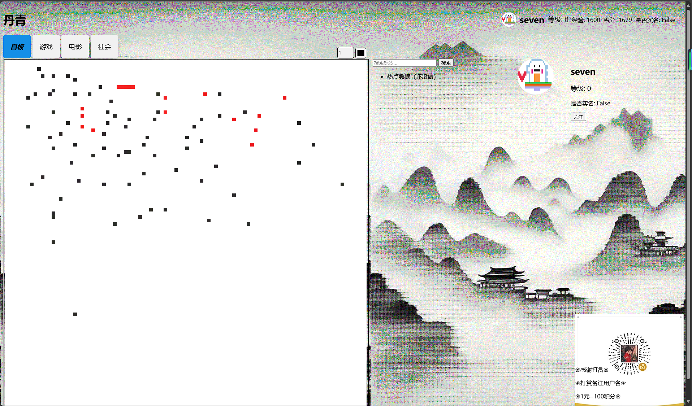
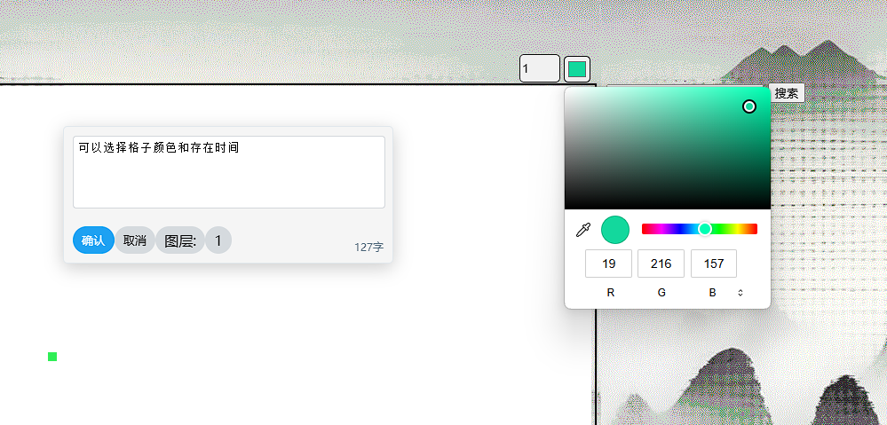
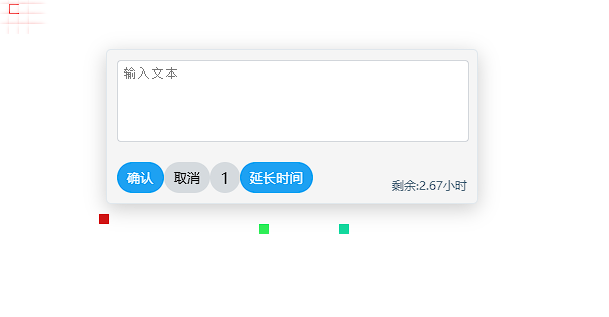
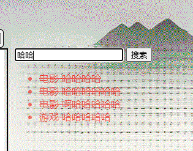
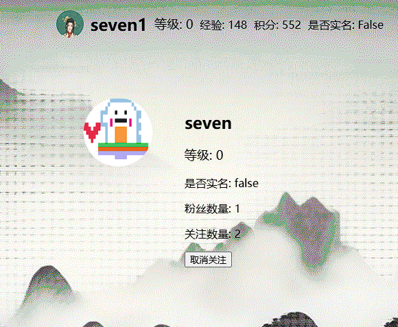
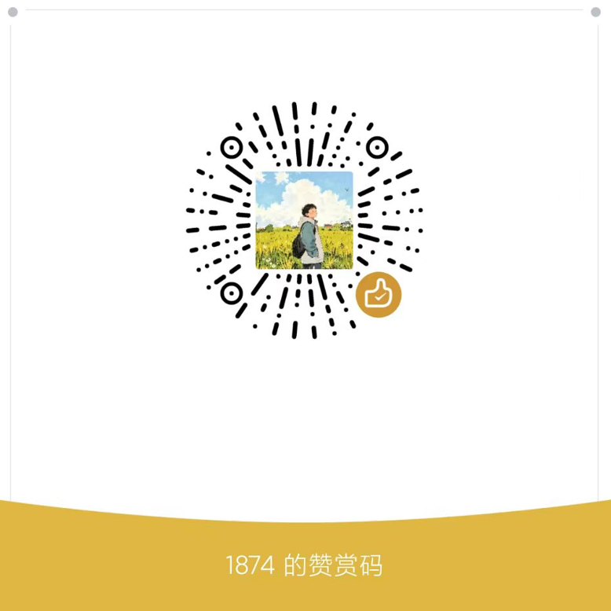

# Pixel

#### 介绍
页面上一个巨大地像素画布，所有用户都可以在上边进行涂鸦，区别是被积分限制。提供了不同主题的标签供用户选择。
前端不会，希望会前端的朋友一起参与进来

# 登录页面

# 主页

同一个格子可以被覆盖3次，达到上限后无法覆盖。也可以对每个当前格子延长存在时间

可以模糊查询标签，过期标签有删除线。每个标签都有对应属于哪一个模块。

点击格子也会显示出该格子是哪个用户绘制。

#### 软件架构
软件架构说明

后端：django

前端：不会

数据库：MySQL

#### 安装教程
配置conda的虚拟环境并且激活

C:\>conda activate django_pixel

cd到项目目录下

(django_pixel) C:\>cd C:\File\PixelProject

运行项目

(django_pixel) C:\File\PixelProject>python manage.py runserver 0.0.0.0:8000

打开浏览器输入127.0.0.1:8000查看

#### 参与贡献

我自己

## 谢谢老板打赏

